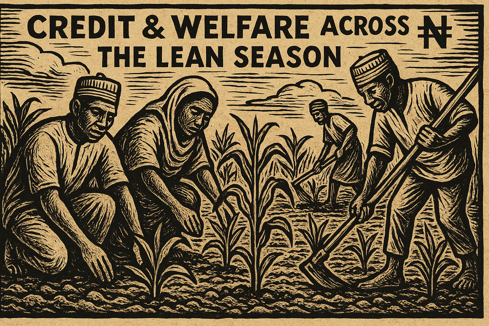

#+title: Ethan Ligon
#+hugo_front_matter_format: yaml
#+hugo_base_dir: ../
#+hugo_section: /
#+author: Ethan Ligon
#+hugo_auto_set_lastmod: t

* General
** Location
:PROPERTIES:
:EXPORT_FILE_NAME: location
:END:
#+begin_description
Address and location for Professor Ethan Ligon.
#+end_description

**** Mailing address
     :PROPERTIES:
     :CUSTOM_ID: mailing-address
     :END:
Professor Ethan Ligon\\
Department of Agricultural & Resource Economics\\
University of California\\
Berkeley, CA 94720-3310

**** Office address
     :PROPERTIES:
     :CUSTOM_ID: office-address
     :END:
Room 213\\
Giannini Hall\\
University of California, Berkeley

**** Office location
     :PROPERTIES:
     :CUSTOM_ID: office-location
     :END:

#+begin_export html
<iframe src="https://www.google.com/maps/embed?pb=!1m18!1m12!1m3!1d3149.433694326736!2d-122.26487888970358!3d37.87353910634951!2m3!1f0!2f0!3f0!3m2!1i1024!2i768!4f13.1!3m3!1m2!1s0x80857c2127240e35%3A0x5c3cfc3e248cdac0!2sGiannini%20Hall%2C%20Berkeley%2C%20CA%2094720!5e0!3m2!1sen!2sus!4v1755215276934!5m2!1sen!2sus" width="600" height="450" style="border:0;" allowfullscreen="" loading="lazy" referrerpolicy="no-referrer-when-downgrade"></iframe>
#+end_export

** Office Hours
:PROPERTIES:
:EXPORT_FILE_NAME: officehours
:END:
#+begin_description
Schedule and location for Professor Ethan Ligon's office hours.
#+end_description

***  Schedule

Please book an appointment below.  If no appointment slots are available, don't hesitate to email me ([[mailto:ligon@berkeley.edu][ligon@berkeley.edu]]).

#+begin_export html
<!-- Google Calendar Appointment Scheduling begin -->
<iframe src="https://calendar.google.com/calendar/appointments/schedules/AcZssZ2fvCrwpslnNUZZplWSlaBWpHt005NSa0VS3tcAeLvpptddBdCpuxWkCMIGSI1g9npiUPeire4I?gv=true" style="border: 0" width="100%" height="600" frameborder="0"></iframe>
<!-- end Google Calendar Appointment Scheduling -->
#+end_export

*** Location

By default meetings are in my office in Giannini 213. I am also available for virtual meetings on Google Meet (preferred) or Zoom.

*** Meeting material
- If we are meeting to discuss research, please send me a written description of the work that you would like to discuss.  I can be much more useful to you if I have time to read and reflect.
  - Presentation slides or paper draft are perfectly fine.
  - If you do not have those, please send a one-page description of the research.
- What's your agenda for the meeting?  Are there particular issues or questions you'd like help or feedback on?
  - Please send me any material and an agenda by 8pm on the day before our meeting.

** Archive
:PROPERTIES:
:EXPORT_FILE_NAME: archive
:export_hugo_custom_front_matter: :layout archives
:END:
#+begin_description
All the papers, courses, and data on this website—listed in reverse-chronological order.
#+end_description

** papers
:PROPERTIES:
:export_hugo_bundle: papers
:EXPORT_FILE_NAME: _index
:END:
#+begin_description
Working papers and articles by Ethan Ligon.
#+end_description

See [[https://scholar.google.com/citations?user=jRwNfxwAAAAJ][google scholar]] for published papers or older working (resting) papers.

** software
:PROPERTIES:
:export_hugo_bundle: software
:EXPORT_FILE_NAME: _index
:END:
#+begin_description
Open-source software projects by Ethan Ligon.
#+end_description

* Papers
** No More Grading: Incentive Compatible Peer Assessment in a Project-Based Course :Education:
:PROPERTIES:
:export_hugo_bundle: papers/ligon26nomoregrading
:EXPORT_FILE_NAME: index
:ID:       1dc637ac-6925-4ee8-ab10-22a76118bff3
:EXPORT_DATE: <2026-04-03 Fri>
:EXPORT_HUGO_CUSTOM_FRONT_MATTER+: :cover '((image . "images/ligon26nomoregrading.png") (alt . "Peer evaluation matrix heatmap showing SVD-extracted quality signal") (relative . t))
:END:

#+begin_description
Describes an incentive-compatible system for grading collaborative student work using peer assessment, SVD-based score extraction, and strategic team formation.
#+end_description

[[/images/ligon26nomoregrading.png]]

#+begin_summary
Grading team projects is hard; getting students to evaluate each other honestly is harder.  We describe a peer-assessment system refined over eight years that uses SVD on residualized evaluations to extract a robust quality signal and rewards careful, honest assessment.
#+end_summary

*** Download
- [[https://escholarship.org/uc/item/2183z6g8][Paper]]
*** Abstract
We describe a system for grading collaborative student work that has
been developed and refined over eight years of a project-based
undergraduate course.  Students complete four team projects per
semester, with teams reassigned each round.  After each project, every
student evaluates other teams' deliverables, assesses their own
teammates' contributions, and predicts the scores they themselves will
receive.  These three streams of assessment data are combined using
singular value decomposition (SVD) applied to residualized evaluation
matrices.  Residualization removes evaluator-specific biases (the
tendency to rate generously or harshly); SVD then extracts the
dominant latent quality axis from the bias-corrected data, weighting
questions by their informativeness.  Scores are aggregated via medians
for robustness to outlier evaluators.  Each student's composite grade
reflects five components: team quality, individual contribution as
assessed by teammates, evaluator discrimination (rewarding careful
assessment of others), and two measures of self-assessment accuracy
(penalizing the gap between predicted and actual peer ratings).  We
map composite scores to letter grades using an anchor-point method
that keys grade boundaries to the median performance of the top five
students, spacing bands at one-third standard deviation intervals.
The system also feeds assessment information forward into team
composition.  Teams are formed via a stratified round-robin algorithm
that spreads technical skill evenly across groups; for subsequent
projects, self-reported skill is replaced by peer-assessed skill.  A
conflict-avoidance mechanism uses "would you work with this person
again" responses to keep incompatible students apart.  We present the
mathematical foundations in enough detail for replication, discuss
incentive properties (robustness to strategic manipulation,
encouragement of honest and thoughtful evaluation), and illustrate the
procedure with a worked numerical example.
*** BibTeX

#+begin_src bibtex
@Unpublished{	  ligon26nomoregrading,
  author	= {Ethan Ligon},
  title		= {No More Grading: Incentive Compatible Peer Assessment
		  in a Project-Based Course},
  note		= {Department of Agricultural and Resource Economics,
		  UC Berkeley},
  year		= 2026,
  url		= {https://escholarship.org/uc/item/2183z6g8}
}
#+end_src

** Consumer Demand with Price Aggregators and Low-Rank Cross-Price Effects :Demand:Agriculture:MUE:
:PROPERTIES:
:export_hugo_bundle: papers/fally-ligon26
:EXPORT_FILE_NAME: index
:ID:       a3c7e1f2-9d84-4a3b-b5e1-7f2a8c6d4e90
:EXPORT_DATE: <2026-03-27 Fri>
:EXPORT_HUGO_CUSTOM_FRONT_MATTER+: :cover '((image . "images/substitution_hero.png") (alt . "Cross-price elasticity heatmap for ready-to-eat cereals") (relative . t))
:END:

#+begin_description
Characterizes preferences that rationalize demand systems with price aggregators, providing flexible and tractable forms for estimating consumer demand with many goods.
#+end_description

[[/images/substitution_hero.png]]

#+begin_summary
Estimating demand for many goods usually means estimating many cross-price effects.  We show that low-rank cross-price structure is equivalent to a small number of "price aggregators," and characterize the preferences behind them.
#+end_summary

*** Download
- [[https://escholarship.org/uc/item/6kr0q483][Paper]]
*** Abstract
Estimating consumer demands is a bread-and-butter undertaking in applied economics. In general, demand for each good depends on the prices of all goods and services, but for most applications it is impractical to estimate models of such high dimension. In this paper, we consider consumer demand with a low rank of the matrix of cross-price effects, a property implicitly assumed in most empirical settings. First, we show that imposing a low rank is equivalent to introducing functions that we call "aggregators", where each aggregator maps information from an arbitrarily large vector of prices (and perhaps income) into a scalar. We then provide a complete characterization of the preferences that rationalize demand systems with such aggregators. These results can be used to derive new and flexible forms of demand that can be tailored to applications in various fields of economics. Most commonly-used demand systems (including directly-additive, indirectly-additive, non-homothetic CES and Kimball preferences) can be described with one or two aggregators where the price index may coincide with one of the aggregators. Nested and mixed logit require as many aggregators as nests or consumer types. Aggregators can also be naturally expressed as a function of observed product attributes. Using barcode data on purchases of ready-to-eat cereals, we illustrate how to estimate a simple yet flexible specification of such a demand system with K aggregators, with or without using information on product attributes.
*** BibTeX

#+begin_src bibtex
@Unpublished{	  fally-ligon26,
  author	= {Thibault Fally and Ethan Ligon},
  title		= {Consumer Demand with Price Aggregators and Low-Rank
		  Cross-Price Effects},
  year		= 2026,
  url		= {https://escholarship.org/uc/item/6kr0q483}
}
#+end_src

** Risk-Sharing Tests and Covariate Shocks: Drought, Floods, and Pests in Uganda :Risk_sharing:Welfare:Poverty:Agriculture:MUE:
:PROPERTIES:
:export_hugo_bundle: papers/ligon25
:EXPORT_FILE_NAME: index
:ID:       d1f24bca-c1e4-4b6f-822d-903565a054b5
:EXPORT_DATE: <2025-08-13 Wed>
:EXPORT_HUGO_CUSTOM_FRONT_MATTER+: :cover '((image . "images/risk-sharing.png") (alt . "Drought in Uganda") (relative . t))
:END:

#+begin_description
Devises new methods to compute households' marginal utilities of expenditure based on nonhomothetic preferences.  This allows us to test efficient risk-sharing even when shocks are covariate.
#+end_description

#+begin_summary
"Covariate" shocks such as droughts or floods may affect everyone, but not everyone is affected equally.  We devise ways to test the extent to which the effects of these shocks are shared.
#+end_summary

*** Download
- [[https://escholarship.org/uc/item/2zr503fq][Paper]]
*** Abstract
Efficient risk-sharing implies a simple factor structure for marginal utilities of expenditure (MUEs): Pareto weights divided by a common price.  The standard approach infers MUEs from total expenditures, implicitly assuming homothetic preferences, unitary income elasticities, and identical price elasticities.  Risk-sharing tests using total expenditures work for idiosyncratic shocks (budgets change, but not prices), but not ``covariate'' shocks (prices change).  We describe all preferences which permit one to infer MUEs from expenditures, and estimate nonhomothetic MUEs to test whether covariate shocks are shared efficiently in Uganda.  This delivers sensible results; the standard approach suggests that droughts, floods, and pests are beneficial.
*** BibTeX

#+begin_src bibtex
@Unpublished{	  ligon25,
  author	= {Ethan Ligon},
  title		= {Risk sharing tests and covariate shocks: Drought, Floods,
		  and Pests in {Uganda}},
  year		= 2025,
  url		= {https://escholarship.org/uc/item/2zr503fq}
}
#+end_src

** Credit and Welfare Across the Lean Season :Welfare:Experiments:Agriculture:MUE:
:PROPERTIES:
:export_hugo_bundle: papers/ligon-silver26
:EXPORT_FILE_NAME: index
:ID:       7fd58773-0994-4468-bf4b-0d92e3449919
:EXPORT_DATE: <2026-03-27 Fri>
:EXPORT_HUGO_CUSTOM_FRONT_MATTER+: :cover '((image . "images/taimaka.png") (alt . "Credit during the lean season in Nigeria") (relative . t))
:END:

#+begin_description
Measures demand for credit across the lean season in Nigeria.
#+end_description

#+begin_summary
The agricultural season naturally induces seasonal variation to prices for things like maize.  Is it possible to make money by timing this market?
#+end_summary

*** Download
- [[https://escholarship.org/uc/item/81k9j2q0][Paper]]
*** Abstract
Consumption expenditures in rural areas of low-income countries are highly variable across seasons, yet the literature still lacks a standard framework for asking whether seasonal poverty reflects local credit market failure or poor integration with the broader economy. We develop an intertemporal model of farmers' portfolio choices under seasonal price risk and borrowing constraints, and derive a sign diagnostic: The amount a farmer is willing to pay for a small risk-free bond (call this price q) must rise in response to a positive income shock if credit constraints bind, but fall if precautionary motives dominate. We apply this framework to a randomized post-harvest loan program in Gombe, Nigeria, and supplement the experiment by also collecting high-frequency data on prices, stocks, and expenditures. The loan sharply reduces the marginal utility of expenditure around delivery, but q never rises over the full follow-up. Precautionary savings, not credit constraints, govern the intertemporal allocation. Receipt of the loan leads to a portfolio rebalancing, as farmers adjust their grain stores, and increase investment. But maize prices increase little after harvest and season-average consumption expenditure effects are small, though the MUE---a more sensitive welfare measure---detects a large and significant improvement around delivery that expenditures miss. We fail to reject the null of well-functioning local financial markets. The binding constraint is poor spatial integration rather than inefficient local allocation---promoting market integration may improve lean-season welfare more than would the local provision of credit.
*** BibTeX
#+begin_src bibtex
@Unpublished{ligon-silver26,
  author          = {Ethan Ligon and Jedidiah Silver},
  title           = {Credit and Welfare Across the Lean Season},
  year = 2026,
  url          = {https://escholarship.org/uc/item/81k9j2q0}}
#+end_src

** Assessing Targeting Performance: The Case of Ghana's LEAP Program :Poverty:Welfare:Development:MUE:
:PROPERTIES:
:export_hugo_bundle: papers/trachtman-ligon25
:EXPORT_FILE_NAME: index
:ID:       5c651b17-7d27-46ad-a6e5-e5bcfd566338
:EXPORT_DATE: <2025-01-01 Wed>
:EXPORT_HUGO_CUSTOM_FRONT_MATTER+: :cover '((image . "images/trachtman-ligon25.png") (alt . "Assessing targeting performance in Ghana") (relative . t))
:END:

#+begin_description
Evaluates targeting accuracy of Ghana's LEAP social protection program using marginal utility of expenditure as a welfare benchmark.
#+end_description

[[/images/trachtman-ligon25.png]]

#+begin_summary
How well do social protection programs reach the poorest?  We assess Ghana's LEAP program and show that community-based targeting may outperform proxy-based methods when evaluated against a marginal-utility benchmark.
#+end_summary

*** Download
- [[https://escholarship.org/uc/item/2zk0m608][Paper]]
*** Abstract
We propose an alternative benchmark for evaluating the targeting accuracy of social protection programs based on the marginal utility of expenditure. Using this benchmark, we assess the targeting performance of Ghana's Livelihood Empowerment Against Poverty (LEAP) program. We find that community-based targeting may yield more accurate targeting outcomes than proxy-based methods under a marginal-utility benchmark, because the latter better captures the welfare losses from poverty that standard consumption-based measures can miss.
*** BibTeX

#+begin_src bibtex
@InCollection{	  trachtman-ligon25,
  author	= {Carly Trachtman and Ethan Ligon},
  title		= {Assessing Targeting Performance: The Case of {Ghana's}
		  {LEAP} Program},
  booktitle	= {Targeting the Poor},
  editor	= {Tauhidur Rahman and Fabrizio Felloni and Indran Naidoo},
  year		= 2025,
  note		= {In press},
  url		= {https://escholarship.org/uc/item/2zk0m608}
}
#+end_src

** Spatial Procurement of Farm Products and the Supply of Processed Foods :Agriculture:Development:
:PROPERTIES:
:export_hugo_bundle: papers/hamilton-ligon-shafran24
:EXPORT_FILE_NAME: index
:ID:       ba364142-18bd-4ea6-931c-d46e47fdac09
:EXPORT_DATE: <2024-02-01 Thu>
:EXPORT_HUGO_CUSTOM_FRONT_MATTER+: :cover '((image . "images/hamilton-ligon-shafran24.png") (alt . "Spatial procurement in the tomato processing industry") (relative . t))
:END:

#+begin_description
Develops a spatial model of farm product procurement by food processors, applied to California's tomato processing industry.
#+end_description

[[/images/hamilton-ligon-shafran24.png]]

#+begin_summary
How do transportation costs shape the geography of food processing?  We model spatial procurement by a California tomato processor and estimate how energy prices affect the supply of processed foods.
#+end_summary

*** Download
- [[https://doi.org/10.1007/s11151-023-09939-5][Paper]]
*** Abstract
Increased transportation and logistical costs in agricultural markets have affected the spatial allocation of production in the agricultural and food sectors of the economy. We develop a spatial model of farm product procurement by a food processor, designed to capture the effects of supply-chain disruptions on the spatial procurement of farm products in the processed food sector. We use detailed data on production and procurement by a large California tomato processor to estimate the key parameters of the model which allow us to calculate the price elasticity of supply for California tomato paste production and describe how changes in energy prices and transportation costs for primary agricultural products affect the supply of processed food.
*** BibTeX

#+begin_src bibtex
@Article{	  hamilton-ligon-shafran24,
  author	= {Stephen Hamilton and Ethan Ligon and Aric Shafran},
  title		= {Spatial Procurement of Farm Products and the Supply of
		  Processed Foods: Application to the Tomato Processing
		  Industry},
  journal	= {Review of Industrial Organization},
  year		= 2024,
  volume	= 64,
  number	= 1,
  pages		= {11--33},
  doi		= {10.1007/s11151-023-09939-5}
}
#+end_src

** Consumption Subaggregates Should Not Be Used to Measure Poverty :Poverty:Welfare:Demand:MUE:
:PROPERTIES:
:export_hugo_bundle: papers/christiaensen-ligon-sohnesen22
:EXPORT_FILE_NAME: index
:ID:       a8fbfb4b-b7d2-45ba-87e7-d9668545aaec
:EXPORT_DATE: <2022-05-01 Sun>
:EXPORT_HUGO_CUSTOM_FRONT_MATTER+: :cover '((image . "images/christiaensen-ligon-sohnesen22.png") (alt . "Consumption subaggregates and poverty measurement") (relative . t))
:END:

#+begin_description
Shows that using consumption subaggregates to measure poverty is theoretically unjustified and empirically misleading.
#+end_description

[[/images/christiaensen-ligon-sohnesen22.png]]

#+begin_summary
Can we save money on surveys by measuring poverty with a few goods instead of full consumption?  Theory says only if all Engel curves are linear; data from East Africa confirm this shortcut fails in practice.
#+end_summary

*** Download
- [[https://doi.org/10.1093/wber/lhab021][Paper]]
*** Abstract
Frequent measurement of poverty is challenging because measurement often relies on complex and expensive expenditure surveys that try to measure expenditures on a comprehensive consumption aggregate. This paper investigates the use of consumption subaggregates instead. The use of consumption subaggregates is theoretically justified if and only if all Engel curves are linear for any realization of prices. This is very stringent. However, it may be possible to empirically identify certain goods that happen to have linear Engel curves given prevailing prices, and when the effect of price changes is small, such a subaggregate might work in practice. We construct such linear subaggregates using data from Rwanda, Tanzania, and Uganda. Our findings show that using subaggregates is ill advised in practice as well as in theory.
*** BibTeX

#+begin_src bibtex
@Article{	  christiaensen-ligon-sohnesen22,
  author	= {Luc Christiaensen and Ethan Ligon and Thomas Pave
		  Sohnesen},
  title		= {Consumption Subaggregates Should Not Be Used to Measure
		  Poverty},
  journal	= {World Bank Economic Review},
  year		= 2022,
  volume	= 36,
  number	= 2,
  pages		= {413--432},
  doi		= {10.1093/wber/lhab021}
}
#+end_src

** Inferring Informal Risk-Sharing Regimes: Evidence from Rural Tanzania :Risk_sharing:Demand:Development:
:PROPERTIES:
:export_hugo_bundle: papers/li-ligon20
:EXPORT_FILE_NAME: index
:ID:       783a2494-bb10-4914-8fc5-9be7aa1a8d5c
:EXPORT_DATE: <2020-09-01 Tue>
:EXPORT_HUGO_CUSTOM_FRONT_MATTER+: :cover '((image . "images/li-ligon20.png") (alt . "Informal risk-sharing regimes in rural Tanzania") (relative . t))
:END:

#+begin_description
Exploits the link between interest rates and consumption moments to test alternative risk-sharing models without interest rate data.
#+end_description

[[/images/li-ligon20.png]]

#+begin_summary
Which model of risk sharing fits village data---full insurance, limited commitment, or self-insurance?  We devise tests that work without interest rate data and find that Tanzanian villages look like self-insurance.
#+end_summary

*** Download
- [[https://escholarship.org/uc/item/50f6t3fh][Paper]]
*** Abstract
This paper studies informal risk-sharing regimes in a unified framework by examining intertemporal consumption behavior of rural households in Tanzania. We exploit a theoretically-consistent link between interest rates and cross-sectional consumption moments to test alternative risk-sharing models without requiring data on interest rates or assuming a restriction to eliminate the need for such data, which are often unavailable in developing economies. We specify tests that allow distinguishing among models even with temporal dependence in income shocks. Our analysis shows that the consumption pattern in rural Tanzania is consistent with the self-insurance regime, and that risk aversion varies substantially across districts. Imposing a strict condition on interest rates, as often done in prior literature, misses their intertemporal heterogeneity and biases the estimation of risk aversion.
*** BibTeX

#+begin_src bibtex
@Article{	  li-ligon20,
  author	= {Zhimin Li and Ethan Ligon},
  title		= {Inferring Informal Risk-Sharing Regimes: Evidence from
		  Rural {Tanzania}},
  journal	= {Journal of Economic Behavior and Organization},
  year		= 2020,
  volume	= 177,
  pages		= {941--955},
  doi		= {10.1016/j.jebo.2020.05.014},
  url		= {https://escholarship.org/uc/item/50f6t3fh}
}
#+end_src

** What Explains Low Adoption of Digital Payment Technologies? :Development:
:PROPERTIES:
:export_hugo_bundle: papers/ligon-etal19
:EXPORT_FILE_NAME: index
:ID:       72c376e8-c925-41f4-b9cd-880d611f3f9c
:EXPORT_DATE: <2019-07-31 Wed>
:EXPORT_HUGO_CUSTOM_FRONT_MATTER+: :cover '((image . "images/ligon-etal19.png") (alt . "Digital payment adoption among merchants in India") (relative . t))
:END:

#+begin_description
Investigates why small-scale merchants in Jaipur, India have low adoption rates for digital payment technologies despite minimal supply-side barriers.
#+end_description

[[/images/ligon-etal19.png]]

#+begin_summary
Digital payment infrastructure is cheap and available, yet adoption remains low among Indian merchants.  We find that demand-side factors---not supply-side barriers---explain the gap.
#+end_summary

*** Download
- [[https://doi.org/10.1371/journal.pone.0219450][Paper]]
*** Abstract
The availability of digital payment technologies has rapidly increased in the developing world as a cornerstone for financial inclusion. Despite significant efforts to promote digital payments, rates of adoption remain modest in some low-income countries, particularly India. We consider possible reasons for the low rates of adoption among merchants in Jaipur, India with small fixed-location store enterprises. Using survey data for 1,003 merchants, we find little evidence that supply-side barriers to obtaining necessary infrastructure or meeting prerequisite requirements to adopt digital payments explain the low level of adoption. Merchants can readily obtain the necessary infrastructure: 98.6% are feasible adopters, 97% have bank accounts, 79% possess internet-capable devices, and 96% demonstrate technological literacy. 54% already satisfy all requirements, yet only 42% have adopted digital payments. Our evidence suggests that low rates of adoption do not appear to be the result of supply-side barriers, but are due rather to demand-side factors, including insufficient customer demand and concerns that transaction records could increase tax liability.
*** BibTeX

#+begin_src bibtex
@Article{	  ligon-etal19,
  author	= {Ethan Ligon and Badal Malick and Ketki Sheth and Carly
		  Trachtman},
  title		= {What Explains Low Adoption of Digital Payment
		  Technologies? {Evidence} from Small-Scale Merchants in
		  {Jaipur}, {India}},
  journal	= {PLoS One},
  year		= 2019,
  volume	= 14,
  number	= 7,
  pages		= {e0219450},
  doi		= {10.1371/journal.pone.0219450}
}
#+end_src

** All \lambda-Separable Demands and Rationalizing Utility Functions :Demand:MUE:
:PROPERTIES:
:export_hugo_bundle: papers/ligon16a
:EXPORT_FILE_NAME: index
:ID:       ff8b29e1-7e6e-486f-8ca8-1b466b9ab862
:EXPORT_DATE: <2016-10-01 Sat>
:EXPORT_HUGO_CUSTOM_FRONT_MATTER+: :cover '((image . "images/ligon16a.png") (alt . "Lambda-separable demands and utility functions") (relative . t))
:END:

#+begin_description
Completely characterizes all Frisch demand systems that are separable in the budget-constraint multiplier, and the utility functions that rationalize them.
#+end_description

[[/images/ligon16a.png]]

#+begin_summary
Frisch demands that are separable in the budget multiplier $\lambda$ turn out to have a surprisingly simple structure.  We give a complete characterization: quantities are $\lambda$-separable iff utility is additively separable.
#+end_summary

*** Download
- [[https://doi.org/10.1016/j.econlet.2016.08.010][Paper]]
*** Abstract
Frisch demands depend on prices and a multiplier $\lambda$ associated with the consumer's budget constraint. Subject only to standard, modest, regularity conditions, we provide a complete characterization of all Frisch demand systems and of the utility functions that rationalize these demand systems when either quantities demanded or consumption expenditures are separable in $\lambda$. Quantities demanded are $\lambda$-separable if and only if the rationalizing utility function is additively separable in these quantities. In contrast, expenditures are $\lambda$-separable if and only if marginal utilities for these expenditures belong to one of two simple parametric families.
*** BibTeX

#+begin_src bibtex
@Article{	  ligon16a,
  author	= {Ethan Ligon},
  title		= {All $\lambda$-Separable Demands and Rationalizing Utility
		  Functions},
  journal	= {Economics Letters},
  year		= 2016,
  volume	= 147,
  pages		= {16--18},
  doi		= {10.1016/j.econlet.2016.08.010}
}
#+end_src

** Some \lambda-Separable Frisch Demands with Utility Functions :Demand:MUE:
:PROPERTIES:
:export_hugo_bundle: papers/ligon16b
:EXPORT_FILE_NAME: index
:ID:       94cd2ecd-866a-4707-941e-6a32272446ca
:EXPORT_DATE: <2016-01-01 Fri>
:EXPORT_HUGO_CUSTOM_FRONT_MATTER+: :cover '((image . "images/ligon16b.png") (alt . "Lambda-separable Frisch demands with utility functions") (relative . t))
:END:

#+begin_description
Provides closed-form utility functions for several families of lambda-separable Frisch demands used in applied work.
#+end_description

[[/images/ligon16b.png]]

#+begin_summary
Many applied demand models assume $\lambda$-separability without checking that a rationalizing utility function exists.  We provide closed-form utility functions for several common families.
#+end_summary

*** Download
- [[https://escholarship.org/uc/item/1s06c2zp][Paper]]
*** Abstract
Many commonly used demand systems in applied economics assume that demands are separable in the multiplier $\lambda$ on the consumer's budget constraint. We provide closed-form expressions for the utility functions that rationalize several important families of $\lambda$-separable Frisch demand systems, including demands that are affine in $\lambda$ and demands with constant expenditure elasticities.
*** BibTeX

#+begin_src bibtex
@Article{	  ligon16b,
  author	= {Ethan Ligon},
  title		= {Some $\lambda$-Separable Frisch Demands with Utility
		  Functions},
  journal	= {Economics Bulletin},
  year		= 2016,
  volume	= 36,
  number	= 1,
  pages		= {A8},
  url		= {https://escholarship.org/uc/item/1s06c2zp}
}
#+end_src

** Motives for Sharing in Social Networks :Risk_sharing:Experiments:
:PROPERTIES:
:export_hugo_bundle: papers/ligon-schechter12
:EXPORT_FILE_NAME: index
:ID:       02313d14-2857-40ff-a49a-9d5dc42027fb
:EXPORT_DATE: <2012-09-01 Sat>
:EXPORT_HUGO_CUSTOM_FRONT_MATTER+: :cover '((image . "images/ligon-schechter12.png") (alt . "Village social network with nodes and edges representing sharing motives") (relative . t))
:END:

#+begin_description
Uses variants of dictator games to decompose motives for sharing in Paraguayan villages into directed altruism, reciprocity, and sanctions.
#+end_description

[[/images/ligon-schechter12.png]]

#+begin_summary
What motivates people in rural villages to share---altruism, reciprocity, or fear of sanctions?  We use dictator game variants to measure each motive, and find that reciprocity best predicts real-world gift-giving.
#+end_summary

*** Download
- [[https://doi.org/10.1016/j.jdeveco.2011.12.002][Paper]]
*** Abstract
What motivates people in rural villages to share? We first elicit a baseline level of sharing using a standard, anonymous dictator game. Then using variants of the dictator game that allow for either revealing the dictator's identity or allowing the dictator to choose the recipient, we attribute variation in sharing to three different motives. The first of these, directed altruism, is related to preferences, while the remaining two are incentive-related (sanctions and reciprocity). We observe high average levels of sharing in our baseline treatment, while variation across individuals depends importantly on the incentive-related motives. Finally, variation in measured reciprocity within the experiment predicts observed 'real-world' gift-giving, while other motives measured in the experiment do not predict behavior outside the experiment.
*** BibTeX

#+begin_src bibtex
@Article{	  ligon-schechter12,
  author	= {Ethan Ligon and Laura Schechter},
  title		= {Motives for Sharing in Social Networks},
  journal	= {Journal of Development Economics},
  year		= 2012,
  volume	= 99,
  number	= 1,
  pages		= {13--26},
  doi		= {10.1016/j.jdeveco.2011.12.002}
}
#+end_src

** Incentives & Nutrition for Rotten Kids: The Quantity & Quality of Food Allocated within Philippine Households :Development:Risk_sharing:
:PROPERTIES:
:export_hugo_bundle: papers/dubois-ligon12
:EXPORT_FILE_NAME: index
:ID:       584c3810-cdb2-459c-a5c7-1aa60f727aa4
:EXPORT_DATE: <2012-02-10 Fri>
:EXPORT_HUGO_CUSTOM_FRONT_MATTER+: :cover '((image . "images/dubois-ligon12.png") (alt . "Quality versus quantity of food allocation contour surface") (relative . t))
:END:

#+begin_description
Distinguishes the quantity and quality of food allocated within households when nutrition affects both utility and future productivity, and tests the model with Philippine data.
#+end_description

[[/images/dubois-ligon12.png]]

#+begin_summary
How does a household decide who eats how much of what?  We show that when nutrition affects future productivity, investing more in one member's nutrition can paradoxically reduce the quality of her food, and test these predictions with individual-level consumption data from Philippine farm households.
#+end_summary

*** Download
- [[https://escholarship.org/uc/item/2r96467x][Paper]]
*** Abstract
We construct a model of food demand which distinguishes between the
nutrients supplied by a particular food bundle and the quality of that
bundle, as measured by its cost.  We show that when nutrition affects
only utility then under rather general conditions it will be optimal
for all members of the household to consume food bundles of identical
quality.  This is true even when household members have private
information about their actions---in this case the /quantity/ of food
given may provide incentives, but quality remains common within the
household.  When nutrition affects household resources our finding that
quality is constant is overturned---in this case when the household
invests more in the nutrition of one member it will simultaneously
/reduce/ the quality of her food bundle.

Using data on individual-level food consumption from a sample of farm
households in the Philippines, we estimate and test a dynamic model of
intra-household food allocation.  We find that individual consumption
shares respond to individual earnings shocks.  At least part of this
response is due to nutritional investments, but it appears that the
allocation of food also plays a role in providing incentives within
the household.
*** BibTeX

#+begin_src bibtex
@Unpublished{	  dubois-ligon12,
  author	= {Pierre Dubois and Ethan Ligon},
  title		= {Incentives \& Nutrition for Rotten Kids: The Quantity \&
		  Quality of Food Allocated within {P}hilippine Households},
  note		= {Unpublished Manuscript},
  year		= 2012,
  url		= {https://escholarship.org/uc/item/2r96467x}
}
#+end_src

** Nutrition and Risk Sharing within the Household :Development:Risk_sharing:
:PROPERTIES:
:export_hugo_bundle: papers/dubois-ligon10
:EXPORT_FILE_NAME: index
:ID:       89b783e1-ed93-4ebe-b536-11c71994b4c8
:EXPORT_DATE: <2010-01-25 Mon>
:EXPORT_HUGO_CUSTOM_FRONT_MATTER+: :cover '((image . "images/dubois-ligon10.png") (alt . "Intra-household food consumption shares over time") (relative . t))
:END:

#+begin_description
Tests risk-sharing within households by contrasting the unitary model with one in which nutrition affects future productivity, using individual consumption data from Philippine farm households.
#+end_description

[[/images/dubois-ligon10.png]]

#+begin_summary
Do households allocate food efficiently among their members?  Using individual consumption data from the Philippines, we test whether nutrition's role in future productivity explains why consumption responds to earnings shocks within the household.
#+end_summary

*** Download
- [[https://escholarship.org/uc/item/2td8z1g3][Paper]]
*** Abstract
Using data on individual consumption from farm households in the
Philippines, we construct a direct test of risk-sharing within the
household.  We contrast the efficient outcomes predicted by the
unitary household model with the outcomes we might expect if food
consumption delivers not only utils, but also nutrients affecting
future productivity.  The efficiency conditions which characterize the
within-household allocation of food under the unitary model are
violated, as consumption responds to earnings shocks.  If productivity
depends on nutrition, this explains some but not all of the response,
as earnings "surprises" have some effect on the cost and composition
of diet.
*** BibTeX

#+begin_src bibtex
@Unpublished{	  dubois-ligon10,
  author	= {Pierre Dubois and Ethan Ligon},
  title		= {Nutrition and Risk Sharing within the Household},
  note		= {CUDARE Working Paper No. 1096},
  year		= 2010,
  url		= {https://escholarship.org/uc/item/2td8z1g3}
}
#+end_src

** Structural Experimentation to Distinguish between Models of Risk Sharing with Frictions in Rural Paraguay :Risk_sharing:Experiments:
:PROPERTIES:
:export_hugo_bundle: papers/ligon-schechter20
:EXPORT_FILE_NAME: index
:ID:       b28fe150-640f-4ef2-87e8-f482883bc128
:EXPORT_DATE: <2020-10-01 Thu>
:EXPORT_HUGO_CUSTOM_FRONT_MATTER+: :cover '((image . "images/ligon-schechter20.png") (alt . "Hands holding umbrella and shields representing risk sharing") (relative . t))
:END:

#+begin_description
Uses dictator-type games in rural Paraguay to distinguish between models of risk sharing with limited commitment, moral hazard, and hidden income.
#+end_description

[[/images/ligon-schechter20.png]]

#+begin_summary
What stops villagers from sharing risk efficiently---limited commitment, moral hazard, or hidden income?  We design lab experiments in rural Paraguay whose predictions differ across models, and find that no single friction explains all villages.
#+end_summary

*** Download
- [[https://doi.org/10.1086/702793][Paper]]
*** Abstract
We conduct dictator-type games in rural Paraguay with different treatments that manipulate players' information and choice sets. From individuals' choices in the games, we draw inferences regarding impediments to efficient risk sharing in the larger village supergame. Outcomes from the experimental games suggest that players in most villages are reacting to the kinds of incentives that would be predicted from a private information model with hidden investments, while in others players act in a manner consistent with the predictions of a model with limited commitment. No single one of our models can explain outcomes in all villages, but outcomes in nearly every village are consistent with one or more of our models.
*** BibTeX

#+begin_src bibtex
@Article{	  ligon-schechter20,
  author	= {Ethan Ligon and Laura Schechter},
  title		= {Structural Experimentation to Distinguish between Models
		  of Risk Sharing with Frictions in Rural {Paraguay}},
  journal	= {Economic Development and Cultural Change},
  year		= 2020,
  volume	= 69,
  number	= 1,
  pages		= {1--50},
  doi		= {10.1086/702793}
}
#+end_src

** Risk-Sharing and Information in Village Economies :Risk_sharing:Development:
:PROPERTIES:
:export_hugo_bundle: papers/ligon98
:EXPORT_FILE_NAME: index
:ID:       e8917bb5-08e4-4cb3-af5f-8b4b2e021b3c
:EXPORT_DATE: <1998-10-01 Thu>
:EXPORT_HUGO_CUSTOM_FRONT_MATTER+: :cover '((image . "images/ligon98.png") (alt . "Risk-sharing and information in village economies") (relative . t))
:END:

#+begin_description
Tests the implications of private information for risk sharing in ICRISAT villages, finding that information problems constrain consumption smoothing.
#+end_description

[[/images/ligon98.png]]

#+begin_summary
Full risk sharing is rejected in Indian village data, but why?  This paper tests whether private information about income explains the pattern of consumption allocations in ICRISAT villages.
#+end_summary

*** Download
- [[https://www.jstor.org/stable/2566915][Paper]]
*** Abstract
Efficient risk sharing implies that consumption allocations depend only on aggregate resources, not on individual income. This prediction is rejected by data from ICRISAT villages in India. This paper considers the possibility that these departures from full risk sharing are due to private information about income. We derive the implications of private information for risk sharing and test these restrictions using data from three Indian villages. We find evidence that private information constrains risk sharing, and that an informationally constrained efficient allocation fits the data significantly better than either full risk sharing or autarky.
*** BibTeX

#+begin_src bibtex
@Article{	  ligon98,
  author	= {Ethan Ligon},
  title		= {Risk Sharing and Information in Village Economies},
  journal	= {Review of Economic Studies},
  year		= 1998,
  volume	= 65,
  number	= 4,
  pages		= {847--864}
}
#+end_src

** Agricultural Contracts: Data and Research Needs :Agriculture:Contracts:
:PROPERTIES:
:export_hugo_bundle: papers/hueth-ligon-dimitri07
:EXPORT_FILE_NAME: index
:ID:       da11bac8-63c0-4d33-85a1-afd292ee589f
:EXPORT_DATE: <2007-12-01 Sat>
:EXPORT_HUGO_CUSTOM_FRONT_MATTER+: :cover '((image . "images/hueth-ligon-dimitri07.png") (alt . "Agricultural contracts data and research needs") (relative . t))
:END:

#+begin_description
Surveys the landscape of agricultural contracting and identifies data collection priorities for advancing research on contracts in agriculture.
#+end_description

[[/images/hueth-ligon-dimitri07.png]]

#+begin_summary
Contracting is pervasive in agriculture, yet systematic data on contract terms remains scarce.  We identify key data gaps and propose a framework for data collection that individual researchers can build on.
#+end_summary

*** Download
- [[https://doi.org/10.1111/j.1467-8276.2007.01096.x][Paper]]
*** Abstract
Contracting is widespread in agriculture, yet there is no systematic data collection on the nature and importance of agricultural contracts. We argue that such data collection is needed to build further knowledge and support more specific research projects. Collecting data from individual contracting parties is difficult, but a summary of responses about specific contract characteristics coupled with sectoral descriptions would provide general information that individual researchers can utilize when launching investigations on more specific topics.
*** BibTeX

#+begin_src bibtex
@Article{	  hueth-ligon-dimitri07,
  author	= {Brent Hueth and Ethan Ligon and Carolyn Dimitri},
  title		= {Agricultural Contracts: Data and Research Needs},
  journal	= {American Journal of Agricultural Economics},
  year		= 2007,
  volume	= 89,
  number	= 5,
  pages		= {1276--1281},
  doi		= {10.1111/j.1467-8276.2007.01096.x}
}
#+end_src

** Risk Management in the Cooperative Contract :Agriculture:Contracts:Risk_sharing:
:PROPERTIES:
:export_hugo_bundle: papers/ligon09
:EXPORT_FILE_NAME: index
:ID:       26156715-0c94-41d4-8712-6e7fbf69022a
:EXPORT_DATE: <2009-12-01 Tue>
:EXPORT_HUGO_CUSTOM_FRONT_MATTER+: :cover '((image . "images/ligon09.png") (alt . "Risk management in the cooperative contract") (relative . t))
:END:

#+begin_description
Shows how agricultural cooperatives can use multi-year relationships to provide insurance against crop shortfalls.
#+end_description

[[/images/ligon09.png]]

#+begin_summary
Cooperatives help members manage marketing risk within a season, but not production risk across years.  We show how the multi-year cooperative relationship can also provide limited crop insurance.
#+end_summary

*** Download
- [[https://doi.org/10.1111/j.1467-8276.2009.01286.x][Paper]]
*** Abstract
Agricultural cooperatives have long played an important role in helping their members manage risk, though they do a much better job of helping members manage some sorts of risk than others. In particular, co-ops are good at helping members manage marketing risk, but seem not to be particularly good at helping their members manage production risk. This paper argues that by taking advantage of the multi-year nature of most members' relationship with the cooperative, the cooperative can also provide a useful, though limited, form of insurance against crop shortfalls.
*** BibTeX

#+begin_src bibtex
@Article{	  ligon09,
  author	= {Ethan Ligon},
  title		= {Risk Management in the Cooperative Contract},
  journal	= {American Journal of Agricultural Economics},
  year		= 2009,
  volume	= 91,
  number	= 5,
  pages		= {1211--1217},
  doi		= {10.1111/j.1467-8276.2009.01286.x}
}
#+end_src

** Using Production Data to Design Efficient Contracts :Agriculture:Contracts:
:PROPERTIES:
:export_hugo_bundle: papers/ligon04
:EXPORT_FILE_NAME: index
:ID:       b3260b00-dbcf-4ec2-aee3-3e5d5ba2ca24
:EXPORT_DATE: <2004-08-01 Sun>
:EXPORT_HUGO_CUSTOM_FRONT_MATTER+: :cover '((image . "images/ligon04.png") (alt . "Using production data to design efficient contracts") (relative . t))
:END:

#+begin_description
Shows how production data can be used to construct optimal contracts for agricultural commodities, applied to California processing tomatoes.
#+end_description

[[/images/ligon04.png]]

#+begin_summary
What does an optimal agricultural contract look like?  We show how to use production data to design incentive-compatible contracts, and apply the method to California's processing tomato industry.
#+end_summary

*** Download
- [[https://doi.org/10.1111/j.0002-9092.2004.00636.x][Paper]]
*** Abstract
This article shows how available production data can be used to construct the terms of an efficient contract. The approach is applied to the design of a contract for processing tomatoes, a commodity for which a variety of different contractual provisions are used in practice. The analysis yields estimates of the efficient level of incentive intensity, the efficient degree of risk sharing, and the welfare cost of using suboptimal contract terms.
*** BibTeX

#+begin_src bibtex
@Article{	  ligon04,
  author	= {Ethan Ligon},
  title		= {Using Production Data to Design Efficient Contracts},
  journal	= {American Journal of Agricultural Economics},
  year		= 2004,
  volume	= 86,
  number	= 3,
  pages		= {848--853},
  doi		= {10.1111/j.0002-9092.2004.00636.x}
}
#+end_src

** Poverty and the Welfare Costs of Risk Associated with Globalization :Poverty:Risk_sharing:Welfare:Development:
:PROPERTIES:
:export_hugo_bundle: papers/ligon06
:EXPORT_FILE_NAME: index
:ID:       15c3d6f1-adf6-4421-b24d-01f658807fca
:EXPORT_DATE: <2006-08-01 Tue>
:EXPORT_HUGO_CUSTOM_FRONT_MATTER+: :cover '((image . "images/ligon06.png") (alt . "Poverty and welfare costs of risk from globalization") (relative . t))
:END:

#+begin_description
Uses 50 years of Lorenz curve data to measure the welfare costs of risk borne by poor households and whether globalization increases that risk.
#+end_description

[[/images/ligon06.png]]

#+begin_summary
Poorer households grow faster on average but bear much more risk.  Using Lorenz curve data from 53 countries over 50 years, we find no evidence that this greater risk is related to globalization.
#+end_summary

*** Download
- [[https://doi.org/10.1016/j.worlddev.2005.10.013][Paper]]
*** Abstract
"Globalization" implies change, and uncertainty over future change may affect household welfare. We use 50 years of Lorenz curve data from 53 mostly developing countries. Treating each country-quintile-year combination as an observation, we first account for variation in consumption expenditures, finding that global shocks matter less than country-level shocks in explaining consumption growth variation. While poorer households experience faster consumption growth than wealthier ones, they also face significantly more risk. However, we find no evidence linking this greater risk to globalization.
*** BibTeX

#+begin_src bibtex
@Article{	  ligon06,
  author	= {Ethan Ligon},
  title		= {Poverty and the Welfare Costs of Risk Associated with
		  Globalization},
  journal	= {World Development},
  year		= 2006,
  volume	= 34,
  number	= 8,
  pages		= {1446--1457},
  doi		= {10.1016/j.worlddev.2005.10.013}
}
#+end_src

** Formal Markets and Informal Insurance :Risk_sharing:Development:
:PROPERTIES:
:export_hugo_bundle: papers/ligon05
:EXPORT_FILE_NAME: index
:ID:       3a546ada-68d9-4ca7-87bf-0df4535b3d4e
:EXPORT_DATE: <2005-03-01 Tue>
:EXPORT_HUGO_CUSTOM_FRONT_MATTER+: :cover '((image . "images/ligon05.png") (alt . "Formal markets and informal insurance") (relative . t))
:END:

#+begin_description
Examines how the introduction of formal credit markets may undermine informal insurance arrangements in developing-country villages.
#+end_description

[[/images/ligon05.png]]

#+begin_summary
Can modern credit markets crowd out informal insurance?  Using data from an Indian village in transition, we find that "traditional" households exchange more in-kind transfers, while "modern" households rely more on formal markets.
#+end_summary

*** Download
- [[https://doi.org/10.1016/j.irle.2004.06.005][Paper]]
*** Abstract
Contractual interlinkages in rural developing communities may provide informal insurance when information is incomplete, potentially shaping resource distribution. The introduction of modern credit markets might undermine these informal arrangements, reducing their effectiveness as insurance. Using data from a transitional Indian village comparing households operating under "modern" and "traditional" regimes, we find that traditional households receive more frequent in-kind food and clothing transfers while making more frequent in-kind crop output payments to others.
*** BibTeX

#+begin_src bibtex
@Article{	  ligon05,
  author	= {Ethan Ligon},
  title		= {Formal Markets and Informal Insurance},
  journal	= {International Review of Law and Economics},
  year		= 2005,
  volume	= 25,
  number	= 1,
  pages		= {75--88},
  doi		= {10.1016/j.irle.2004.06.005}
}
#+end_src

** Measuring Vulnerability :Welfare:Poverty:Risk_sharing:
:PROPERTIES:
:export_hugo_bundle: papers/ligon-schechter03
:EXPORT_FILE_NAME: index
:ID:       b813029e-6c50-4d79-b5d6-cb368ae59592
:EXPORT_DATE: <2003-03-01 Sat>
:EXPORT_HUGO_CUSTOM_FRONT_MATTER+: :cover '((image . "images/ligon-schechter03.png") (alt . "Measuring vulnerability to poverty and risk") (relative . t))
:END:

#+begin_description
Constructs a measure of vulnerability that decomposes welfare losses into components due to poverty, aggregate risk, and idiosyncratic risk.
#+end_description

[[/images/ligon-schechter03.png]]

#+begin_summary
Standard poverty measures miss the welfare costs of risk.  We construct a vulnerability measure that decomposes welfare losses into poverty and risk components, and find they play roughly equal roles in Bulgaria.
#+end_summary

*** Download
- [[https://doi.org/10.1111/1468-0297.00117][Paper]]
*** Abstract
We construct a measure of vulnerability which permits us to decompose the welfare loss associated with living in a risky environment. This decomposition lets us separately measure the welfare loss due to poverty and the welfare loss due to risk from different sources. Applying this decomposition to a panel dataset from Bulgaria, we find that poverty and risk play roughly equal roles in reducing welfare. Aggregate shocks are more important than idiosyncratic sources of risk, but households headed by an employed, educated male are less vulnerable to aggregate shocks than are other households.
*** BibTeX

#+begin_src bibtex
@Article{	  ligon-schechter03,
  author	= {Ethan Ligon and Laura Schechter},
  title		= {Measuring Vulnerability},
  journal	= {Economic Journal},
  year		= 2003,
  volume	= 113,
  number	= 486,
  pages		= {C95--C102},
  doi		= {10.1111/1468-0297.00117}
}
#+end_src

** Optimal Risk in Agricultural Contracts :Agriculture:Contracts:Risk_sharing:
:PROPERTIES:
:export_hugo_bundle: papers/ligon02
:EXPORT_FILE_NAME: index
:ID:       0c09b102-b0bb-419f-a1d8-450f11e9a1d4
:EXPORT_DATE: <2002-01-01 Tue>
:EXPORT_HUGO_CUSTOM_FRONT_MATTER+: :cover '((image . "images/ligon02.png") (alt . "Optimal risk in agricultural contracts") (relative . t))
:END:

#+begin_description
Characterizes the optimal level of risk in agricultural production contracts, showing that "less risk" need not mean "smaller variance."
#+end_description

[[/images/ligon02.png]]

#+begin_summary
When farmers produce under contract, there is a tension between risk and incentives.  We provide a simple characterization of optimal risk and show that "less risk" need not mean "smaller variance."
#+end_summary

*** Download
- [[https://doi.org/10.1016/S0308-521X(02)00069-0][Paper]]
*** Abstract
When farmers produce under contract, there may be an important tension between risk and incentives. We provide a simple characterization of the optimal risk in any production system. We also show that "less risk" need not imply "smaller variance," and that while at the margin the behavior of risk-averse farmers may appear to be nearly risk-neutral, it does not follow that one can generally treat such producers "as if" they were risk-neutral without being greatly led astray.
*** BibTeX

#+begin_src bibtex
@Article{	  ligon02,
  author	= {Ethan Ligon},
  title		= {Optimal Risk in Agricultural Contracts},
  journal	= {Agricultural Systems},
  year		= 2002,
  volume	= 75,
  pages		= {265--276},
  doi		= {10.1016/S0308-521X(02)00069-0}
}
#+end_src

** Estimation of an Efficient Tomato Contract :Agriculture:Contracts:
:PROPERTIES:
:export_hugo_bundle: papers/hueth-ligon02
:EXPORT_FILE_NAME: index
:ID:       60835140-3141-4226-b1ed-7d7a6175d372
:EXPORT_DATE: <2002-06-01 Sat>
:EXPORT_HUGO_CUSTOM_FRONT_MATTER+: :cover '((image . "images/hueth-ligon02.png") (alt . "Estimation of an efficient tomato contract") (relative . t))
:END:

#+begin_description
Estimates an agency model of processing tomato contracts, measuring grower risk aversion and the efficiency of existing quality measurement.
#+end_description

[[/images/hueth-ligon02.png]]

#+begin_summary
What does an efficient contract between tomato growers and processors look like?  We estimate an agency model and find that existing quality measurement improves efficiency, but information constraints still cost about 1% of mean compensation.
#+end_summary

*** Download
- [[https://doi.org/10.1093/erae/29.2.237][Paper]]
*** Abstract
An agency model of contracts used in California's processing-tomato industry is estimated in three stages. We first estimate growers' stochastic production possibilities, and then, for a given vector of preference parameters, compute an optimal compensation schedule. Finally, we compare computed compensations with actual compensations and choose preference parameters to minimise distance between the two. Assuming perfect competition and risk neutrality for processors, we obtain an estimate of 0.08 for growers' measure of constant absolute risk aversion, and find that growers who face higher-powered incentives produce higher levels of soluble solids, at a cost that is 1.8 per cent greater than otherwise. Efficiency losses from information constraints are 1 per cent of mean compensation, whereas existing quality measurement improves efficiency by 1.08 per cent.
*** BibTeX

#+begin_src bibtex
@Article{	  hueth-ligon02,
  author	= {Brent Hueth and Ethan Ligon},
  title		= {Estimation of an Efficient Tomato Contract},
  journal	= {European Review of Agricultural Economics},
  year		= 2002,
  volume	= 29,
  number	= 2,
  pages		= {237--253},
  doi		= {10.1093/erae/29.2.237}
}
#+end_src

** Agricultural Markets as Relative Performance Evaluation :Agriculture:Contracts:
:PROPERTIES:
:export_hugo_bundle: papers/hueth-ligon01
:EXPORT_FILE_NAME: index
:ID:       d2f70374-5d37-409e-a187-f6adca8a9e33
:EXPORT_DATE: <2001-05-01 Tue>
:EXPORT_HUGO_CUSTOM_FRONT_MATTER+: :cover '((image . "images/hueth-ligon01.png") (alt . "Agricultural markets as relative performance evaluation") (relative . t))
:END:

#+begin_description
Shows that agricultural spot markets can function as relative performance evaluation, using market prices to infer grower effort.
#+end_description

[[/images/hueth-ligon01.png]]

#+begin_summary
Spot markets for agricultural commodities reveal information about grower quality that contracts can exploit.  We show how market prices serve as a form of relative performance evaluation.
#+end_summary

*** Download
- [[https://www.jstor.org/stable/1244675][Paper]]
*** Abstract
We develop a model in which an agricultural spot market serves as a relative performance evaluation device. In this setting, the market price conveys information about factors common to all growers, such as weather, which helps to distinguish the quality of an individual grower's effort from factors beyond the grower's control. We derive the optimal contract between a processor and a grower and show that the contract offers the grower partial insurance against market price fluctuations while retaining incentives for effort.
*** BibTeX

#+begin_src bibtex
@Article{	  hueth-ligon01,
  author	= {Brent Hueth and Ethan Ligon},
  title		= {Agricultural Markets as Relative Performance Evaluation},
  journal	= {American Journal of Agricultural Economics},
  year		= 2001,
  volume	= 83,
  number	= 2,
  pages		= {318--328}
}
#+end_src

** Policing Mechanisms in Agricultural Contracts :Agriculture:Contracts:
:PROPERTIES:
:export_hugo_bundle: papers/wolf-hueth-ligon01
:EXPORT_FILE_NAME: index
:ID:       b9d1b426-a9e1-43c1-a2d5-8170a121a0bb
:EXPORT_DATE: <2001-09-01 Sat>
:EXPORT_HUGO_CUSTOM_FRONT_MATTER+: :cover '((image . "images/wolf-hueth-ligon01.png") (alt . "Policing mechanisms in agricultural contracts") (relative . t))
:END:

#+begin_description
Identifies four policing instruments in California fruit and vegetable contracts: input control, monitoring, quality measurement, and revenue sharing.
#+end_description

[[/images/wolf-hueth-ligon01.png]]

#+begin_summary
How do processors ensure that growers deliver the quality they promise?  We identify four policing instruments---input control, monitoring, quality measurement, and revenue sharing---used in California produce contracts.
#+end_summary

*** Download
- [[https://doi.org/10.1111/j.1549-0831.2001.tb00072.x][Paper]]
*** Abstract
We examine mechanisms of coordination in agricultural contracts, with an approach intended to advance understanding of social relations of production and distribution of power in agrofood systems. Through analysis of contracts between farmers and intermediaries for California fruits and vegetables, we identify three functions of contracts: they help to coordinate production, they provide incentives to induce particular behaviors, and they allow farmers and intermediaries to share risk. These functions are implemented via four policing instruments: input control, monitoring, quality measurement, and revenue sharing, which are employed by intermediaries to mitigate blind spots in contracts and to control farmers' actions and the quality of their output.
*** BibTeX

#+begin_src bibtex
@Article{	  wolf-hueth-ligon01,
  author	= {Steven Wolf and Brent Hueth and Ethan Ligon},
  title		= {Policing Mechanisms in Agricultural Contracts},
  journal	= {Rural Sociology},
  year		= 2001,
  volume	= 66,
  number	= 3,
  pages		= {359--382},
  doi		= {10.1111/j.1549-0831.2001.tb00072.x}
}
#+end_src

** Agricultural Supply Response Under Contract :Agriculture:Contracts:Risk_sharing:
:PROPERTIES:
:export_hugo_bundle: papers/hueth-ligon99a
:EXPORT_FILE_NAME: index
:ID:       dabfbaf6-c88b-48b0-ba4e-8e9575abf743
:EXPORT_DATE: <1999-08-01 Sun>
:EXPORT_HUGO_CUSTOM_FRONT_MATTER+: :cover '((image . "images/hueth-ligon99a.png") (alt . "Agricultural supply response under contract") (relative . t))
:END:

#+begin_description
Analyzes how contracts with risk-neutral intermediaries change the supply response of risk-averse agricultural producers.
#+end_description

[[/images/hueth-ligon99a.png]]

#+begin_summary
How does contracting change a farmer's supply response to price changes?  When intermediaries absorb risk and farmers have private information, supply response is dampened relative to spot-market farming.
#+end_summary

*** Download
- [[https://www.jstor.org/stable/1244022][Paper]]
*** Abstract
We consider four environments in which agricultural producers might operate, studying the role of price and production risk in shaping farmers' supply-response decisions. In the first two environments, farmers market their own produce and are risk neutral and risk averse, respectively. In the third, farmers are risk averse, but risk neutral intermediation predicts that farmers should not face any production or price risk. In the final environment, risk neutral intermediation continues but the possibility of private information for farmers is admitted, which rationalizes exposure to production and price risk and suggests that a farmer's response to a change in expected price will be less pronounced than in other environments.
*** BibTeX

#+begin_src bibtex
@Article{	  hueth-ligon99a,
  author	= {Brent Hueth and Ethan Ligon},
  title		= {Agricultural Supply Response Under Contract},
  journal	= {American Journal of Agricultural Economics},
  year		= 1999,
  volume	= 81,
  number	= 3,
  pages		= {610--615}
}
#+end_src

** Producer Price Risk and Quality Measurement :Agriculture:Contracts:
:PROPERTIES:
:export_hugo_bundle: papers/hueth-ligon99b
:EXPORT_FILE_NAME: index
:ID:       1f4ddb14-d48c-4d14-9448-27236513187a
:EXPORT_DATE: <1999-08-01 Sun>
:EXPORT_HUGO_CUSTOM_FRONT_MATTER+: :cover '((image . "images/hueth-ligon99b.png") (alt . "Producer price risk and quality measurement") (relative . t))
:END:

#+begin_description
Shows that imperfect quality measurement creates a moral hazard problem in which efficient contracts expose growers to residual price risk.
#+end_description

[[/images/hueth-ligon99b.png]]

#+begin_summary
Why don't contracts fully insure growers against price risk?  Because price conveys information about quality that direct measurement misses, so efficient contracts leave growers exposed to some price risk.
#+end_summary

*** Download
- [[https://www.jstor.org/stable/1244011][Paper]]
*** Abstract
Risk-averse farmers in the produce industry grow a product whose market price is often quite unpredictable. Shippers or other intermediaries shield the farmer from much of this price risk; however, actual contracts between growers and shippers vary considerably across commodities in the residual price risk growers face. We hypothesize that imperfect quality measurement results in a moral hazard problem, and that price provides additional information regarding quality. As a consequence, an efficient contract does not shield growers from all idiosyncratic price risk.
*** BibTeX

#+begin_src bibtex
@Article{	  hueth-ligon99b,
  author	= {Brent Hueth and Ethan Ligon},
  title		= {Producer Price Risk and Quality Measurement},
  journal	= {American Journal of Agricultural Economics},
  year		= 1999,
  volume	= 81,
  number	= 3,
  pages		= {512--524}
}
#+end_src

** Incentive Instruments in Fruit and Vegetable Contracts :Agriculture:Contracts:
:PROPERTIES:
:export_hugo_bundle: papers/hueth-etal99
:EXPORT_FILE_NAME: index
:ID:       6a2fae28-4c3d-46ce-bf85-9f339bb889da
:EXPORT_DATE: <1999-09-01 Wed>
:EXPORT_HUGO_CUSTOM_FRONT_MATTER+: :cover '((image . "images/hueth-etal99.png") (alt . "Incentive instruments in fruit and vegetable contracts") (relative . t))
:END:

#+begin_description
Identifies four generic incentive instruments used in California fruit and vegetable contracts to coordinate grower-handler relationships.
#+end_description

[[/images/hueth-etal99.png]]

#+begin_summary
Contracts between growers and handlers use four instruments---input control, field visits, quality measurement, and residual price risk---to align incentives and coordinate production in California produce markets.
#+end_summary

*** Download
- [[https://www.jstor.org/stable/1349886][Paper]]
*** Abstract
We examine the structure of contractual relations between growers and first handlers in California fruit and vegetable markets. We identify four generic instruments---input control, field visits, quality measurement, and residual price risk---which are used to coordinate relations between growers and first handlers and which help to alleviate information asymmetries and align incentives between contracting parties.
*** BibTeX

#+begin_src bibtex
@Article{	  hueth-etal99,
  author	= {Brent Hueth and Ethan Ligon and Steven Wolf and Steven
		  Wu},
  title		= {Incentive Instruments in Fruit and Vegetable Contracts:
		  Input Control, Monitoring, Measuring, and Price Risk},
  journal	= {Review of Agricultural Economics},
  year		= 1999,
  volume	= 21,
  number	= 2,
  pages		= {374--389}
}
#+end_src

** Economic Distance and Cross-Country Spillovers :Development:
:PROPERTIES:
:export_hugo_bundle: papers/conley-ligon02
:EXPORT_FILE_NAME: index
:ID:       e5fcfc5f-de91-42fd-af50-409201577456
:EXPORT_DATE: <2002-06-01 Sat>
:EXPORT_HUGO_CUSTOM_FRONT_MATTER+: :cover '((image . "images/conley-ligon02.png") (alt . "Economic distance and cross-country growth spillovers") (relative . t))
:END:

#+begin_description
Estimates the magnitude of cross-country growth spillovers using a novel measure of economic distance between nations.
#+end_description

[[/images/conley-ligon02.png]]

#+begin_summary
Growth rates are not independent across countries.  We use a novel measure of economic distance to estimate cross-country spillovers, and find they rival countries' own characteristics in explaining growth patterns.
#+end_summary

*** Download
- [[https://doi.org/10.1023/A:1015676113101][Paper]]
*** Abstract
Rates of long-run economic growth are not independent across countries. To account for this dependence we decompose the spatial covariance function of growth rates into a function of each country's own observable characteristics, its unobservable characteristics, and cross-country spillovers. We use original data on economic distance to structure observed variation in countries' long term growth rates. We use this structure to estimate the magnitude of economic interdependence among nations, and to give a nonparametric characterization of the relationship between economic distance and the magnitude of cross-country spillovers. These spillovers turn out to be quite important, accounting for more of the spatial covariance in growth rates than unobservable variables, and by some measures rivalling the importance of the country's own observable characteristics.
*** BibTeX

#+begin_src bibtex
@Article{	  conley-ligon02,
  author	= {Timothy G. Conley and Ethan Ligon},
  title		= {Economic Distance and Cross-Country Spillovers},
  journal	= {Journal of Economic Growth},
  year		= 2002,
  volume	= 7,
  number	= 2,
  pages		= {157--187},
  doi		= {10.1023/A:1015676113101}
}
#+end_src

** Mutual Insurance, Individual Savings, and Limited Commitment :Risk_sharing:
:PROPERTIES:
:export_hugo_bundle: papers/ligon-thomas-worrall00
:EXPORT_FILE_NAME: index
:ID:       3b7cc963-c48f-4d79-9413-7e7217943386
:EXPORT_DATE: <2000-04-01 Sat>
:EXPORT_HUGO_CUSTOM_FRONT_MATTER+: :cover '((image . "images/ligon-thomas-worrall00.png") (alt . "Mutual insurance with savings and limited commitment") (relative . t))
:END:

#+begin_description
Examines how the availability of individual savings interacts with informal mutual insurance when commitment is limited.
#+end_description

[[/images/ligon-thomas-worrall00.png]]

#+begin_summary
When households can both save individually and insure informally, how do the two interact?  We show that an enhanced storage technology can either improve or diminish welfare, and that ex ante transfers are replaced by differential storage.
#+end_summary

*** Download
- [[https://doi.org/10.1006/redy.1999.0081][Paper]]
*** Abstract
We examine a dynamic model of mutual insurance when households can also engage in self-insurance by storage, assuming there is no enforcement mechanism so that any insurance is informal and must be self-enforcing. We show that consumption allocations satisfy a modified Euler condition and that an enhanced storage technology can either improve or diminish welfare. We also show that ex ante transfers introduced into dynamic informal insurance models are only used in the first period, with the role of ex ante transfers being replaced by differential individual storage.
*** BibTeX

#+begin_src bibtex
@Article{	  ligon-thomas-worrall00,
  author	= {Ethan Ligon and Jonathan P. Thomas and Tim Worrall},
  title		= {Mutual Insurance, Individual Savings, and Limited
		  Commitment},
  journal	= {Review of Economic Dynamics},
  year		= 2000,
  volume	= 3,
  number	= 2,
  pages		= {216--246},
  doi		= {10.1006/redy.1999.0081}
}
#+end_src

** Informal Insurance Arrangements with Limited Commitment :Risk_sharing:
:PROPERTIES:
:export_hugo_bundle: papers/ligon-thomas-worrall02
:EXPORT_FILE_NAME: index
:ID:       df5c866a-6b28-4fe8-922e-420da771ffe3
:EXPORT_DATE: <2002-01-01 Tue>
:EXPORT_HUGO_CUSTOM_FRONT_MATTER+: :cover '((image . "images/ligon-thomas-worrall02.png") (alt . "Dependence of sustainable risk-sharing intervals on the discount factor") (relative . t))
:END:

#+begin_description
Characterises efficient informal insurance arrangements constrained by limited commitment, and tests the model using data from three Indian villages.
#+end_description

[[/images/ligon-thomas-worrall02.png]]

#+begin_summary
Why don't villagers fully pool risk?  We show that limited commitment---the option to walk away---constrains informal insurance, and test the model with ICRISAT village data from India.
#+end_summary

*** Download
- [[https://doi.org/10.1111/1467-937X.00204][Paper]]
*** Abstract
Recent work on consumption allocations in village economies finds that idiosyncratic variation in consumption is systematically related to idiosyncratic variation in income, thus rejecting the hypothesis of full risk-pooling. We attempt to explain these observations by adding limited commitment as an impediment to risk-pooling. We provide a general dynamic model and completely characterise efficient informal insurance arrangements constrained by limited commitment, and test the model using data from three Indian villages. We find that the model can fully explain the dynamic response of consumption to income, but that it fails to explain the distribution of consumption across households.
*** BibTeX

#+begin_src bibtex
@Article{	  ligon-thomas-worrall02,
  author	= {Ethan Ligon and Jonathan P. Thomas and Tim Worrall},
  title		= {Informal Insurance Arrangements with Limited Commitment:
		  Theory and Evidence from Village Economies},
  journal	= {Review of Economic Studies},
  year		= 2002,
  volume	= 69,
  number	= 1,
  pages		= {209--244},
  doi		= {10.1111/1467-937X.00204}
}
#+end_src

** Dynamic Bargaining in Households (with an Application to Bangladesh) :Risk_sharing:Development:
:PROPERTIES:
:export_hugo_bundle: papers/ligon02dynamic
:EXPORT_FILE_NAME: index
:ID:       3485a0c2-ac09-4e41-8c2b-371a586da335
:EXPORT_DATE: <2002-05-09 Thu>
:EXPORT_HUGO_CUSTOM_FRONT_MATTER+: :cover '((image . "images/ligon02dynamic.png") (alt . "Dynamic Pareto weight paths for household members") (relative . t))
:END:

#+begin_description
Uses a dynamic limited-commitment framework to model intra-household bargaining, replacing the Pareto-optimality axiom of Nash Bargaining with a weaker efficiency notion.
#+end_description

[[/images/ligon02dynamic.png]]

#+begin_summary
Nash Bargaining predicts Pareto-optimal allocations, but forward-looking household members should smooth away income shocks.  We replace Pareto optimality with limited commitment and show how this resolves the puzzle of women borrowers voluntarily surrendering Grameen Bank loans to their husbands.
#+end_summary

*** Download
- [[https://escholarship.org/uc/item/1t52k4c5][Paper]]
*** Abstract
Much recent empirical work on intra-household allocation uses the
axiomatic Nash Bargaining model to make predictions about how the
distribution of consumption within the household will respond to
individuals' income shocks.  However, one of the basic axioms
underlying this approach is that allocations will be Pareto optimal,
so forward-looking, risk adverse household members ought to be
expected to smooth away any such response to income shocks---Pareto
optimality seems to be too strong in a dynamic setting.  In this paper
we use explicitly dynamic framework and replace the axiom of Pareto
optimality with a weaker notion of efficiency.  We give a simple
algorithm for computing allocations, and construct an extended
example, meant to model the effects of Grameen Bank lending on
intra-household allocation in Bangladesh.  The model resolves a puzzle
in the literature, namely, it predicts that women borrowers will often
voluntarily surrender control ("pipeline") their loans to their
husbands.
*** BibTeX

#+begin_src bibtex
@Unpublished{	  ligon02dynamic,
  author	= {Ethan Ligon},
  title		= {Dynamic Bargaining in Households (with an Application
		  to {B}angladesh)},
  note		= {CUDARE Working Paper No. 25102, Department of Agricultural
		  and Resource Economics, UC Berkeley},
  year		= 2002,
  url		= {https://escholarship.org/uc/item/1t52k4c5}
}
#+end_src

** Liquidity Constraints and Incentive Contracts :Contracts:Development:
:PROPERTIES:
:export_hugo_bundle: papers/lehnert-ligon-townsend99
:EXPORT_FILE_NAME: index
:ID:       71337365-036e-45b4-868e-e05b74e8bb88
:EXPORT_DATE: <1999-03-01 Mon>
:EXPORT_HUGO_CUSTOM_FRONT_MATTER+: :cover '((image . "images/lehnert-ligon-townsend99.png") (alt . "Liquidity constraints and incentive contracts") (relative . t))
:END:

#+begin_description
Develops methods to distinguish whether firms and households face exogenous credit constraints or endogenous constraints arising from moral hazard or limited commitment.
#+end_description

[[/images/lehnert-ligon-townsend99.png]]

#+begin_summary
Are firms credit-constrained, or do they just look that way?  We develop methods to distinguish exogenous borrowing limits from endogenous constraints that arise from incentive problems.
#+end_summary

*** Download
- [[https://doi.org/10.1017/S1365100599010019][Paper]]
*** Abstract
Are firms and households constrained in the use of a productive input? Theoretical approaches to this question range from exogenously imposed credit allocation rules to endogenous market failures stemming from limited-commitment or moral-hazard problems. We develop and implement econometric methods that allow us to distinguish among these different sources of constraints. We apply these methods to Thai data on rice farmers and find evidence consistent with moral hazard but not with exogenous credit constraints.
*** BibTeX

#+begin_src bibtex
@Article{	  lehnert-ligon-townsend99,
  author	= {Andreas Lehnert and Ethan Ligon and Robert Townsend},
  title		= {Liquidity Constraints and Incentive Contracts},
  journal	= {Macroeconomic Dynamics},
  year		= 1999,
  volume	= 3,
  number	= 1,
  pages		= {1--47},
  doi		= {10.1017/S1365100599010019}
}
#+end_src

** Government Management of Village Commons :Development:
:PROPERTIES:
:export_hugo_bundle: papers/ligon-narain99
:EXPORT_FILE_NAME: index
:ID:       e61a8136-7821-41ed-8164-d09e05964474
:EXPORT_DATE: <1999-05-01 Sat>
:EXPORT_HUGO_CUSTOM_FRONT_MATTER+: :cover '((image . "images/ligon-narain99.png") (alt . "Government management of village commons") (relative . t))
:END:

#+begin_description
Compares two government policies for managing village forest commons when direct enforcement is difficult.
#+end_description

[[/images/ligon-narain99.png]]

#+begin_summary
When governments cannot directly enforce forest conservation, they may try to give villagers a share of the harvest.  We compare this Joint Forest Management policy to a simple benchmark and ask who prefers which.
#+end_summary

*** Download
- [[https://doi.org/10.1006/jeem.1998.1066][Paper]]
*** Abstract
When monitoring or enforcement is difficult, governments may find it impossible to manage village forest commons directly. Village-level institutions might be better able to manage these commons, yet villagers' management objectives may not coincide with those of the state. We consider the effects of two different government policies on the local management of village commons. One policy tool attempts to induce villagers to conserve forest commons by giving them a share of the timber harvest. We investigate whether this Joint Forest Management scheme is preferred either by the villagers or the government to a simple benchmark policy under which the government harvests at random.
*** BibTeX

#+begin_src bibtex
@Article{	  ligon-narain99,
  author	= {Ethan Ligon and Urvashi Narain},
  title		= {Government Management of Village Commons},
  journal	= {Journal of Environmental Economics and Management},
  year		= 1999,
  volume	= 37,
  pages		= {272--289},
  doi		= {10.1006/jeem.1998.1066}
}
#+end_src

** Computing the Equilibria of Dynamic Common Property Games :Development:
:PROPERTIES:
:export_hugo_bundle: papers/ligon-narain97
:EXPORT_FILE_NAME: index
:ID:       cd4d0073-74bb-49b4-bfd7-23a0cc7837ce
:EXPORT_DATE: <1997-10-01 Wed>
:EXPORT_HUGO_CUSTOM_FRONT_MATTER+: :cover '((image . "images/ligon-narain97.png") (alt . "Computing equilibria of dynamic common property games") (relative . t))
:END:

#+begin_description
Develops computational methods for finding equilibria of dynamic games in which multiple agents exploit a common-pool resource.
#+end_description

[[/images/ligon-narain97.png]]

#+begin_summary
Dynamic common-property games are hard to solve.  We develop computational methods for finding their equilibria and apply them to village forest management problems.
#+end_summary

*** Download
*** Abstract
We develop computational methods for finding the equilibria of dynamic games in which multiple agents exploit a common-pool resource. These methods allow us to characterize the set of subgame-perfect equilibria for a class of common property resource games, including games with heterogeneous players and asymmetric information.
*** BibTeX

#+begin_src bibtex
@Article{	  ligon-narain97,
  author	= {Ethan Ligon and Urvashi Narain},
  title		= {Computing the Equilibria of Dynamic Common Property
		  Games},
  journal	= {Natural Resource Modeling},
  year		= 1997,
  volume	= 10,
  number	= 4,
  pages		= {345--369}
}
#+end_src

** The Swamp and the Shopping Center: An Interest Rate Parable :Development:
:PROPERTIES:
:export_hugo_bundle: papers/berck-ligon96
:EXPORT_FILE_NAME: index
:ID:       2e165011-1649-4b6c-b6aa-e87e49e4882e
:EXPORT_DATE: <1996-01-01 Mon>
:EXPORT_HUGO_CUSTOM_FRONT_MATTER+: :cover '((image . "images/berck-ligon96.png") (alt . "The swamp and the shopping center") (relative . t))
:END:

#+begin_description
Uses a parable of a swamp and a shopping center to illustrate how the choice of discount rate affects cost-benefit analysis of environmental projects.
#+end_description

[[/images/berck-ligon96.png]]

#+begin_summary
Should you drain the swamp to build a shopping center?  The answer depends on the discount rate, and this parable shows why the choice of rate matters so much for environmental cost-benefit analysis.
#+end_summary

*** Download
*** Abstract
We use a parable involving the decision to drain a swamp to build a shopping center to illustrate the importance of the discount rate in environmental cost-benefit analysis. The parable demonstrates that standard discounting practices can lead to decisions that are neither efficient nor sustainable, and that the choice of discount rate is itself an economic decision with important welfare implications.
*** BibTeX

#+begin_src bibtex
@Article{	  berck-ligon96,
  author	= {Peter Berck and Ethan Ligon},
  title		= {The Swamp and the Shopping Center: An Interest Rate
		  Parable},
  journal	= {Ecological Modelling},
  year		= 1996,
  volume	= 92,
  pages		= 275
}
#+end_src

** Estimating the Relative Benefits of Agricultural Growth on the Distribution of Expenditures :Agriculture:Poverty:Development:Welfare:
:PROPERTIES:
:export_hugo_bundle: papers/ligon-sadoulet18
:EXPORT_FILE_NAME: index
:ID:       c2ec5407-7a71-4f70-9b54-4388e41dcd0c
:EXPORT_DATE: <2018-09-01 Sat>
:EXPORT_HUGO_CUSTOM_FRONT_MATTER+: :cover '((image . "images/ligon-sadoulet18.png") (alt . "Expenditure gains by decile from agricultural vs non-agricultural growth") (relative . t))
:END:

#+begin_description
Estimates the relative benefits of agricultural versus non-agricultural GDP growth on household expenditures across the income distribution.
#+end_description

[[/images/ligon-sadoulet18.png]]

#+begin_summary
GDP growth originating in agriculture benefits poorer households 3--4 times more than equivalent growth from non-agriculture.  An earlier version of this result was featured in the World Development Report 2008.
#+end_summary

*** Download
- [[https://escholarship.org/uc/item/3zh92962][Paper]]
*** Abstract
Does the sectoral composition of aggregate economic growth affect poverty? We ask whether agricultural growth in developing countries increases the expenditures of poorer households more than growth in other sectors. While some reduced form analyses have tackled this question using either country-level time series data, regional panel data for one country, or cross-sectional country data, this paper is unusual in using panel data for many countries. We improve on much of the existing literature by devising an instrumental variables strategy to correct for the endogeneity of sectoral GDP growth, involving averaging over sectoral income growth rates for neighboring countries. Our principal finding from our instrumental variable estimator is that the estimated elasticities associated with growth in agricultural income are significantly greater than for non-agricultural income for all but the extreme top and bottom deciles. In the middle range of the income distribution the effect of a given GDP growth due to agriculture is 3--4 times larger than if it was due to non-agricultural activities. Having established that on average growth in GDP originating in agriculture is more beneficial for poorer deciles, we finally explore whether this is a pattern which holds across different groupings of countries. A second important finding is that there is heterogeneity across some groupings. Most particularly, we find that it is the poorest people in the poorest countries for whom agricultural income growth is the most beneficial.
*** BibTeX

#+begin_src bibtex
@Article{	  ligon-sadoulet18,
  author	= {Ethan Ligon and Elisabeth Sadoulet},
  title		= {Estimating the Relative Benefits of Agricultural Growth
		  on the Distribution of Expenditures},
  journal	= {World Development},
  year		= 2018,
  volume	= 109,
  pages		= {417--428},
  doi		= {10.1016/j.worlddev.2016.12.007},
  url		= {https://escholarship.org/uc/item/3zh92962}
}
#+end_src

* Software
** LSMS Library :Data:Development:Python:
:PROPERTIES:
:export_hugo_bundle: software/lsms-library
:EXPORT_FILE_NAME: index
:ID:       a57b3c5b-63a8-4712-9de6-d077e66a0cbc
:EXPORT_DATE: <2025-05-06 Tue>
:EXPORT_HUGO_CUSTOM_FRONT_MATTER+: :cover '((image . "images/lsms-library.png") (alt . "Country-by-wave data availability grid for LSMS surveys") (relative . t))
:END:

#+begin_description
A Python library providing uniform access to Living Standards Measurement Study household survey data across countries and years.
#+end_description

[[/images/lsms-library.png]]

#+begin_summary
LSMS datasets are invaluable for poverty research but each country uses different variable names, food codes, and file formats.  Rather than harmonizing the data itself, =LSMS_Library= provides an abstraction layer that standardizes how you /access/ the data, preserving granularity that traditional harmonization loses.
#+end_summary

*** Links
- [[https://github.com/ligon/LSMS_Library][GitHub Repository]]
- [[https://pypi.org/project/LSMS-Library/][PyPI Package]]

*** Overview
LSMS_Library is a Python library offering uniform access to Living
Standards Measurement Study (LSMS) household surveys across multiple
countries and years.  Each country uses different variable names, food
classifications, questionnaire structures, and file formats.
Researchers either invest weeks learning each dataset or settle for
pre-harmonized data that sacrifices detail.

Rather than harmonizing data itself, the library provides an
abstraction layer that standardizes how you access the data across
different LSMS surveys.  Install via =pip install LSMS_Library= and
access data through consistent method calls returning standardized
DataFrames.

*** Citation

#+begin_src bibtex
@Software{	  ligon25lsms,
  author	= {Ethan Ligon},
  title		= {{LSMS\_Library}: Abstraction Layer for Living Standards
		  Measurement Surveys},
  year		= 2025,
  publisher	= {Zenodo},
  doi		= {10.5281/zenodo.17258079},
  url		= {https://github.com/ligon/LSMS_Library}
}
#+end_src

** sucoder :Software:Python:
:PROPERTIES:
:export_hugo_bundle: software/sucoder
:EXPORT_FILE_NAME: index
:ID:       4ef2bdd3-ac67-4b26-a1eb-a3c0de049839
:EXPORT_DATE: <2026-02-16 Mon>
:EXPORT_HUGO_CUSTOM_FRONT_MATTER+: :cover '((image . "images/sucoder.png") (alt . "Sue Coder at her cyberpunk terminal") (relative . t))
:END:

#+begin_description
Sandbox for AI coding agents using Unix filesystem permissions---treating the agent as a collaborator with its own account.
#+end_description

[[/images/sucoder.png]]

#+begin_summary
Unix permissions have been battle-tested for fifty years: give a new collaborator their own account and let the filesystem enforce the boundaries.  =sucoder= applies the same principle to AI coding agents, sandboxing them in mirror clones with full write access while protecting the human's canonical repository.
#+end_summary

*** Links
- [[https://github.com/ligon/sucoder][GitHub Repository]]

*** Overview
sucoder treats an LLM coding agent (Claude, Codex, Gemini) as a
collaborator with its own Unix account.  The human's canonical
repository is group-readable but not group-writable; the agent works
in a sandboxed mirror clone where it has full write access.

The =sucoder collaborate= command resolves configuration, prepares the
canonical repo, clones or verifies the mirror, syncs or creates task
branches, composes agent launch commands, launches the agent, and
reviews results.  Features include git worktree support for parallel
agent work, remote execution on HPC clusters via SSH, tmux session
management, and compliance auditing of agent-written code.
